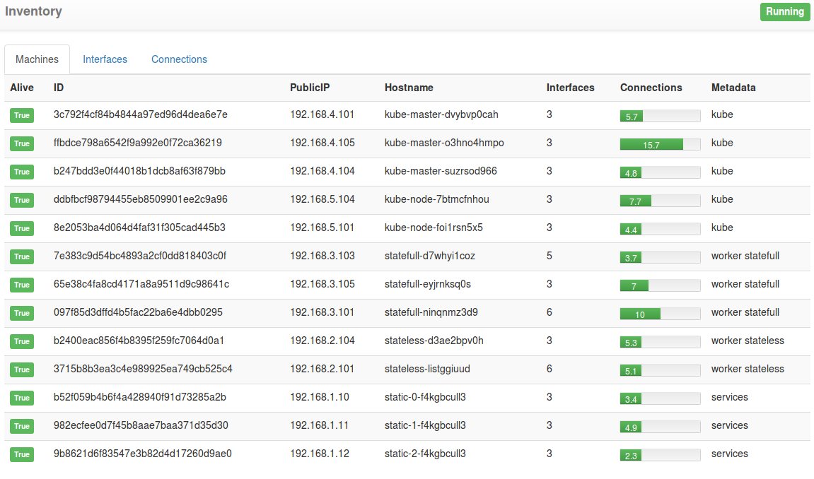
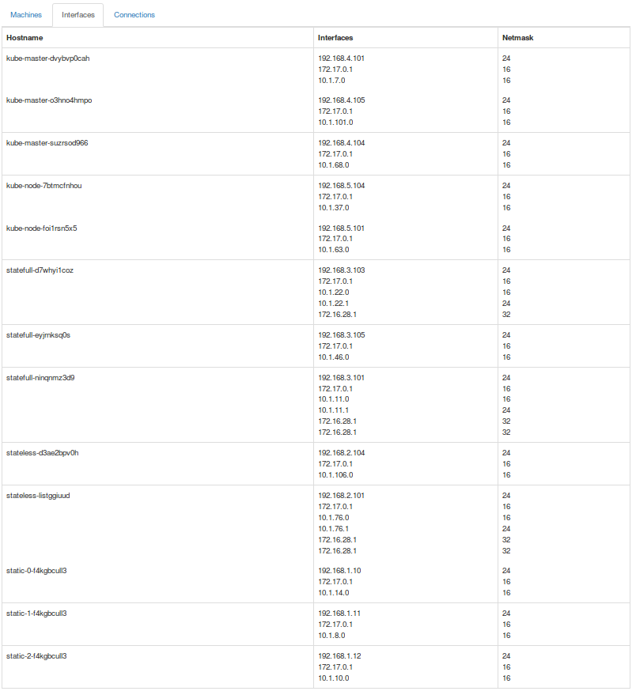
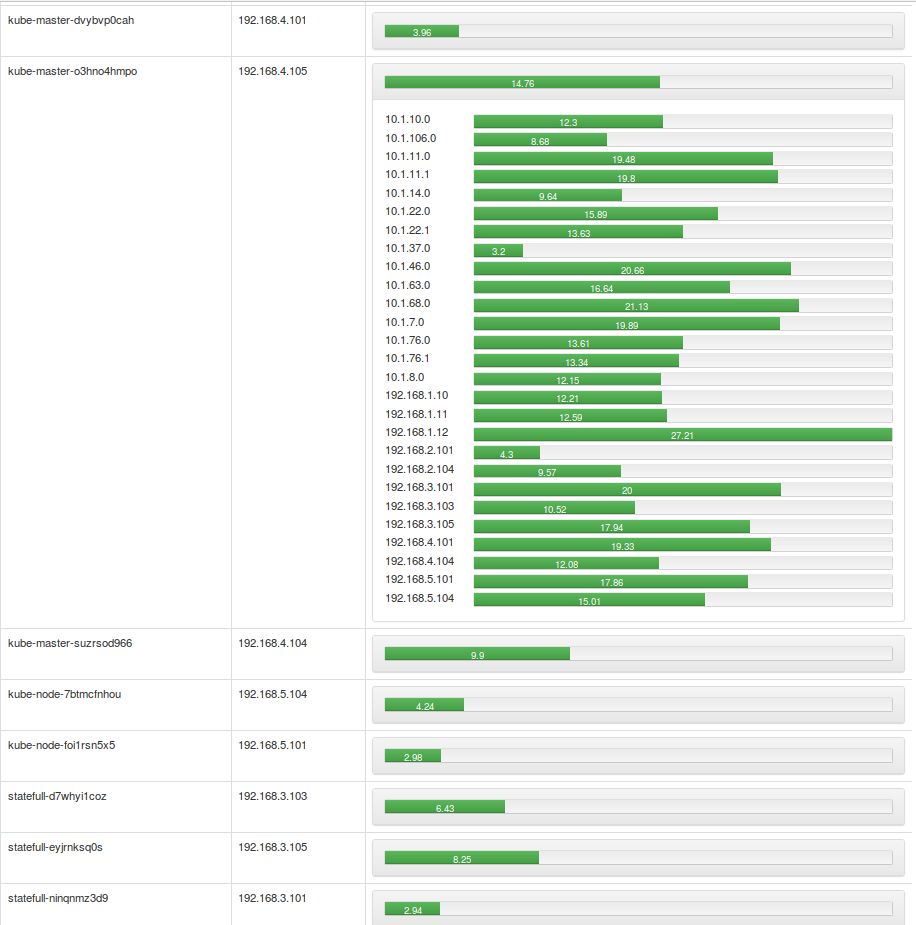

# Inventory

Small project to Learn Golang and JavaScript

## Purpose

Over a CoreOS cluster with Fleet, obtain an overview of the cluster topology.
Therefore you can obtain a network topology for physical networks between hosts and inside the Flannel overlay.
Easily visualize is the control plane match the current deployment. 

## Overviews

### By machines

### By Interfaces

### By Connections

## Example

    ./misc/quick_dev.sh
    
    # Generate 8 running containers
    
    curl -s 127.0.0.1:5000/api/v0 | jq '. | length'
    8

    # If we pick just one,
    # we can get all the latencies from this container to all the 7 others
    curl -s 127.0.0.1:5000/api/v0 | jq .[0]
    {
      "ID": "009",
      "PublicIP": "172.17.0.9",
      "Metadata": {
        "role": "docker"
      },
      "Version": "0.11.7",
      "Hostname": "581bcca93793",
      "Interfaces": [
        {
          "IPv4": "172.17.0.9",
          "CIDR": "172.17.0.0/16",
          "Netmask": 16
        }
      ],
      "Alive": true,
      "Connections": [
        {
          "IPv4": "172.17.0.7",
          "Reach": true,
          "LatencyMs": 0.21792799999997214
        },
        {
          "IPv4": "172.17.0.8",
          "Reach": true,
          "LatencyMs": 0.482765000000029
        },
        {
          "IPv4": "172.17.0.2",
          "Reach": true,
          "LatencyMs": 0.27975299999997105
        },
        {
          "IPv4": "172.17.0.3",
          "Reach": true,
          "LatencyMs": 0.3706399999999803
        },
        {
          "IPv4": "172.17.0.5",
          "Reach": true,
          "LatencyMs": 1.075962000000004
        },
        {
          "IPv4": "172.17.0.6",
          "Reach": true,
          "LatencyMs": 0.8772339999999872
        },
        {
          "IPv4": "172.17.0.4",
          "Reach": true,
          "LatencyMs": 1.8746209999999905
        }
      ]
    }
    
    
#### Go routine
    
    time curl -s 127.0.0.1:5000/api/v0 > /dev/null
    
    real	0m0.028s
    user	0m0.004s
    sys	0m0.000s

Add more: 
    
    curl -s 127.0.0.1:5000/api/v0 | jq '. | length'
    20

    time curl -s 127.0.0.1:5000/api/v0 > /dev/null
    
    real	0m0.109s
    user	0m0.004s
    sys	0m0.000s
